Based on the analysis results from the 'goodreads.csv' dataset, we can draw several insights regarding patterns, trends, and potential areas for further investigation.

### Summary of Insights

1. **Dataset Overview**:
   - The dataset comprises 10,000 books, containing valuable attributes such as authors, publication years, ratings, and reviews. The predominant language is English (top language code is 'eng'), which accounts for 6341 entries.
   
2. **Missing Values**:
   - The dataset has a few missing values, particularly in ‘isbn’ (700 missing), ‘isbn13’ (585 missing), ‘original_publication_year’ (21 missing), ‘original_title’ (585 missing), and ‘language_code’ (1084 missing). This could affect analyses that rely on these columns, necessitating imputation or exclusion of these records.

3. **Average Ratings and Reviews**:
   - The average rating across all books is approximately 4.00, suggesting that the collection tends to represent well-rated books. Ratings tend to be relatively high across the board, with a maximum average rating of 4.82.
   - The ratings distribution suggests a positive skew, with 5-star ratings being the most common (mean: 23789.81), indicating a concentration of highly rated titles, while 1-star ratings are significantly fewer (mean: 1345.04).

4. **Publication Year Trends**:
   - The average original publication year is around 1982, indicating that many titles are older but still hold relevance. However, there are records dating back as early as -1750, possibly indicating erroneous or placeholder entries.

5. **Authors**:
   - The dataset features 4,664 unique authors, with 'Stephen King' being the most frequently mentioned (60 occurrences). This concentration of authorship suggests popular authors dominate the dataset.

6. **Books Count**:
   - The mean number of books per author is about 75.71, with a maximum of 3,455 books linked to a single author, highlighting prolific authors in the dataset.

7. **Correlation Observations**:
   - Notably, the ratings counts show a strong correlation with the number of works and text reviews. Higher ratings are often associated with higher counts of ratings and reviews. However, there is a negative correlation between the books count and ratings, suggesting that sole authors may have varied experiences with popular, standout books.

8. **Outliers**:
   - The maximum ratings count is 4,780,653, which might indicate a standout title that garnered significant attention. A closer examination of this title and others with unusually high or low ratings could provide insight into what drives engagement.

### Additional Analyses to Consider

To gain deeper insights into the dataset, consider the following analyses:

1. **Clustering**:
   - Implement clustering algorithms (like k-means) on features such as average rating, total ratings, and review counts to identify groups of books that share similar characteristics (e.g., popular genres, high-rated books, etc.). This can help marketers target specific demographics.

2. **Anomaly Detection**:
   - Use algorithms like Isolation Forest or DBSCAN to detect outlier books that may perform exceptionally well or poorly compared to their peers. This could indicate poor data quality or exceptional circumstances surrounding certain titles.

3. **Sentiment Analysis**:
   - If any text reviews exist, perform a sentiment analysis on these text reviews. Correlating sentiment scores with rating distributions could uncover trends in reader satisfaction beyond numerical ratings.

4. **Time-Series Analysis**:
   - Investigate trends over time — for example, how average ratings and publication years might correlate. This could illuminate preferences in reading habits, shifts in genres, or the longevity of certain titles.

5. **Genre Analysis**:
   - Although genre information isn't directly provided in the current data structure, if it can be inferred or added, analyzing genre popularity based on ratings and reviews could yield tremendous insights into consumer preferences.

6. **Language and Internationalization**:
   - Examining how books in different languages or from different regions rate could provide insights into cultural preferences and the international appeal of certain authors or titles.

7. **Predictive Modeling**:
   - Build a predictive model to forecast ratings based on initial reviews and author prominence, allowing stakeholders to assess potential investment in new titles.

By carrying out these additional analyses, stakeholders can derive actionable insights that can inform decisions on marketing strategies, inventory management, and customer engagement initiatives based on reader trends and behaviors.

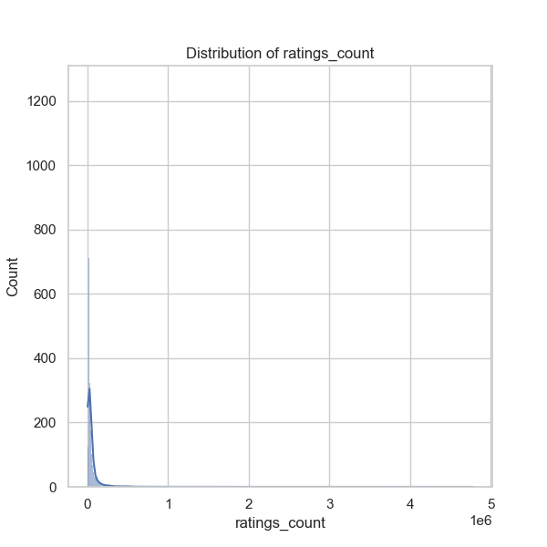
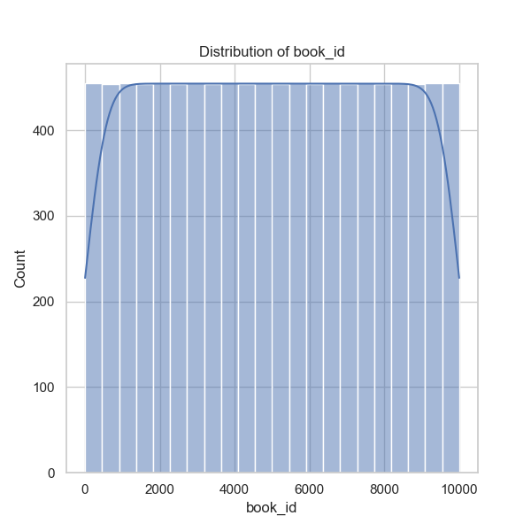
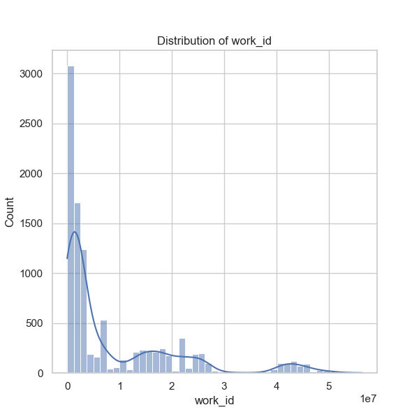
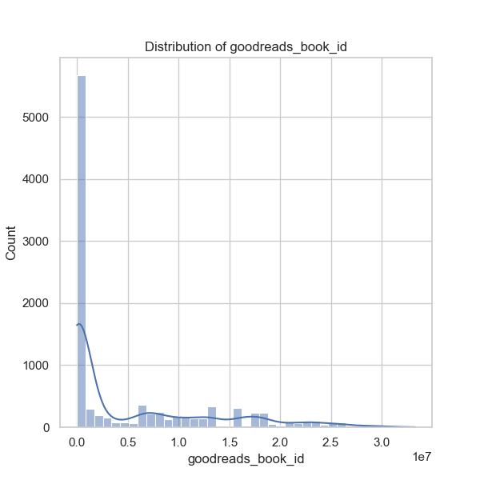
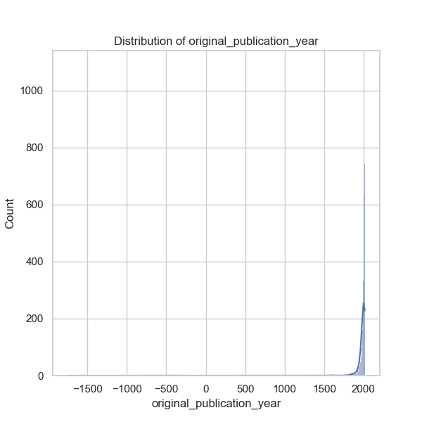
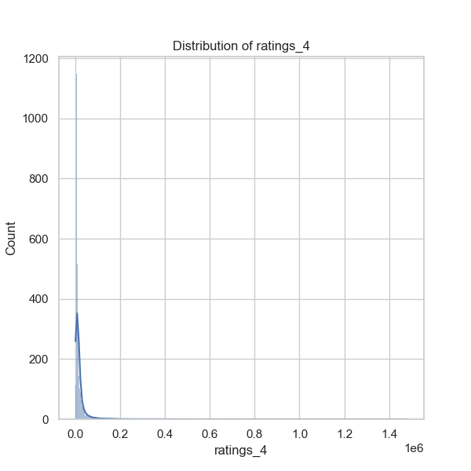
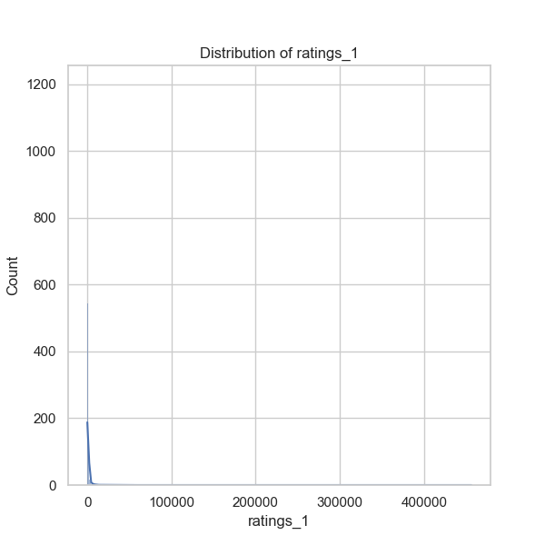
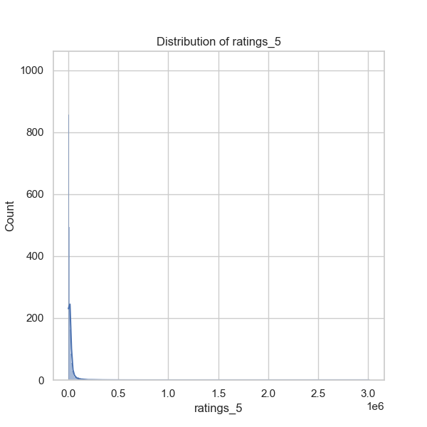
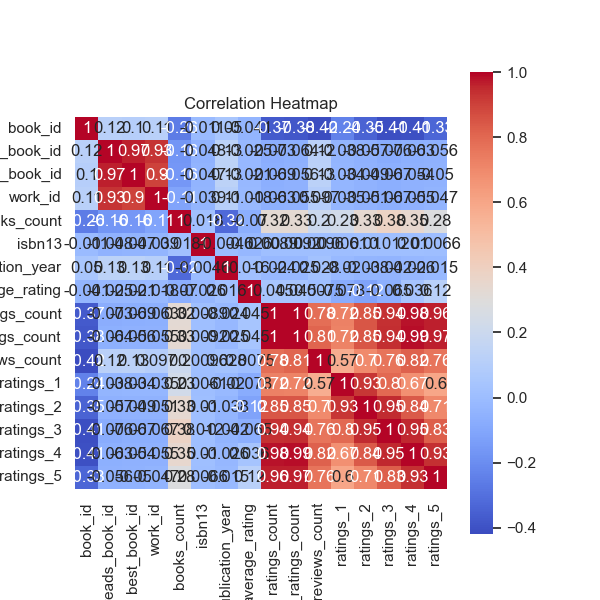
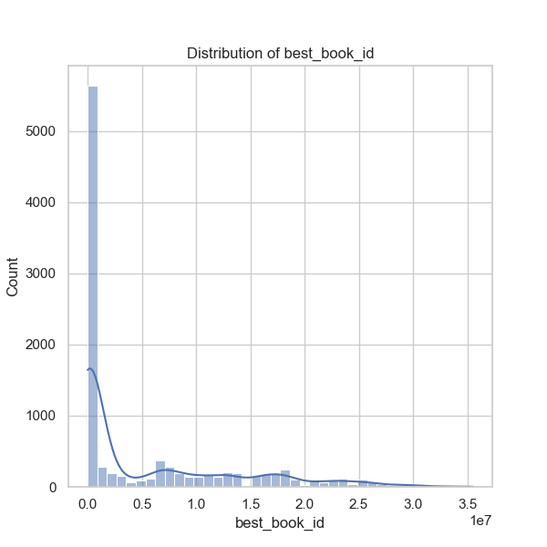
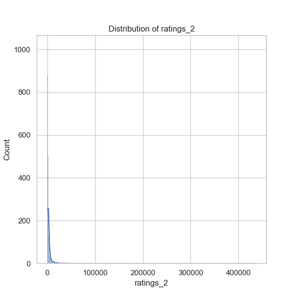
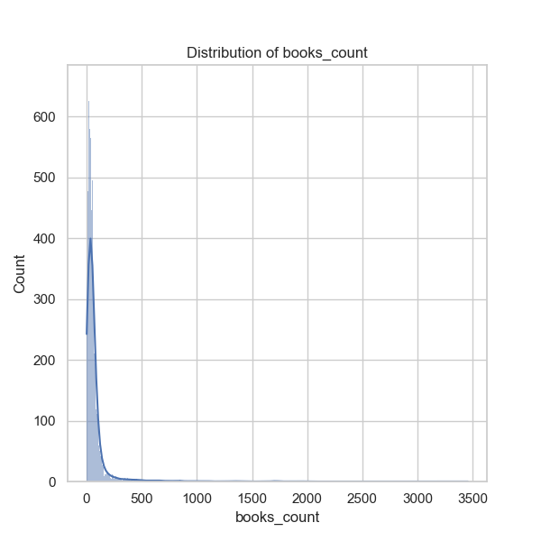
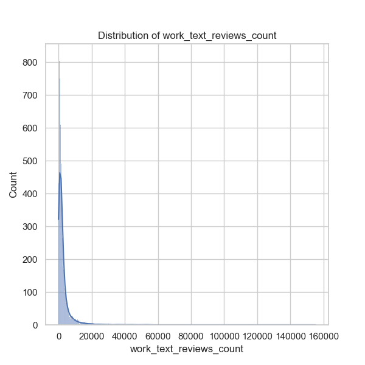
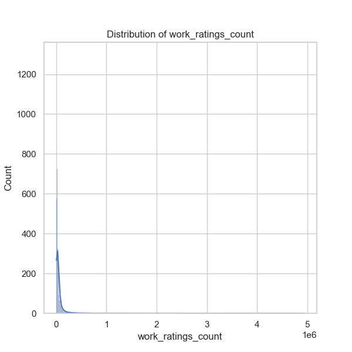
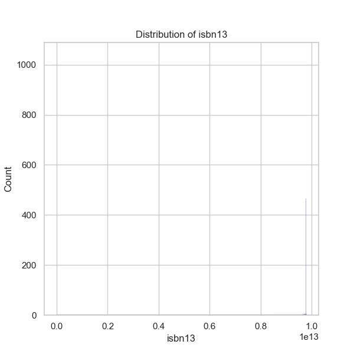
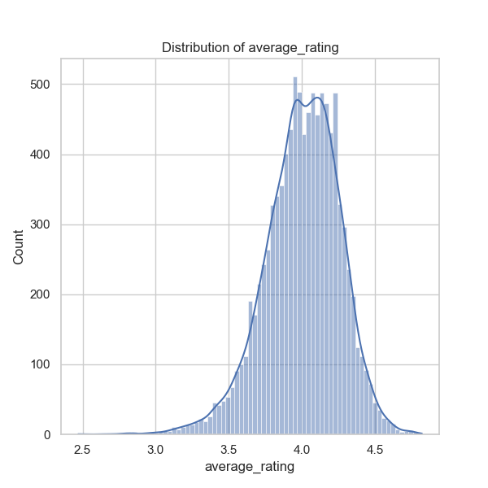
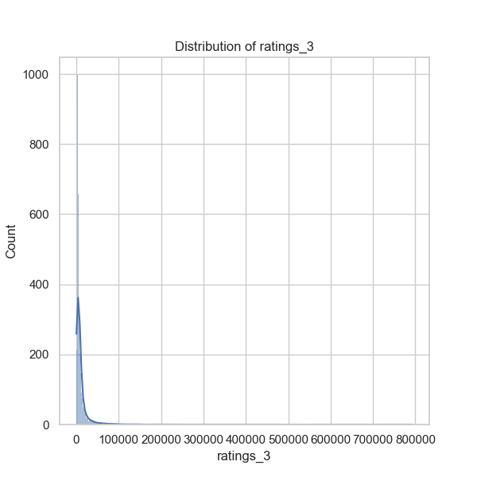