### Data Analysis Narrative for 'happiness.csv'

The dataset 'happiness.csv' encompasses a wealth of information about happiness measures across different countries from the year 2005 to 2023. It includes key indicators such as GDP per capita, social support, health expectancy, and perceptions of corruption, which are all crucial elements contributing to a country's overall happiness or life satisfaction, often captured through the metric "Life Ladder."

#### Overview of the Data

1. **Country Information:**
   - There are 2363 total records featuring responses from 165 countries, with Lebanon being the most frequently reported country, appearing 18 times. This indicates that Lebanon may be well-represented in the dataset, potentially reflecting a unique perspective on happiness.
  
2. **Temporal Scope:**
   - The year averages around 2015, with data spanning from 2005 to 2023, suggesting that this dataset captures a significant time period, allowing for temporal analysis of happiness trends.

3. **Key Variables:**
   - **Life Ladder:** The average score of 5.48, with a standard deviation of 1.13, suggests a moderate level of happiness among the participants. The minimum score of 1.28 indicates outlier low happiness levels which merit further investigation.
   - **Log GDP per capita:** The mean value of 9.40 (approximately $12,000 in purchasing power terms) suggests a reasonable standard of living, but analysis into how this correlates with happiness could be insightful.
   - **Social Support:** An average of 0.81 implies strong social networks, hinting at a correlation between social ties and happiness.

4. **Missing Values:**
   - The dataset exhibits several missing values across variables, most notably in 'Generosity' (81 missing) and 'Healthy life expectancy at birth' (63 missing). Handling these missing values is critical before conducting deeper analyses, possibly employing imputation methods or excluding incomplete records.

#### Correlation Insights

The correlation matrix sheds light on how various factors interact and their relationship with overall happiness ('Life Ladder'):

- **Strong Positive Correlations:**
  - 'Log GDP per capita' (0.78) and 'Life Ladder' suggest that higher economic prosperity is significantly associated with increased happiness.
  - 'Social support' (0.72) and 'Life Ladder' underlines the importance of social connections in enhancing life satisfaction.
  
- **Negative Correlations:**
  - 'Perceptions of corruption' and 'Life Ladder' (-0.43) indicate that higher corruption perceptions correlate with lower happiness, illuminating a significant political dimension to population well-being.

- **Moderate to Strong Correlations:**
  - Other notable correlations include 'Freedom to make life choices' (0.54) and 'Healthy life expectancy at birth' (0.71), both underscoring factors that enhance individual agency and health as contributors to happiness.

#### Trends and Outliers

- A clear trend emerges where countries with lower GDP figures tend to report lower happiness levels, but exceptions (potential outliers) could be present, particularly from countries with high levels of social support that soften the impact of lower economic status.
  
- Anomalies may arise, such as countries where the 'Life Ladder' score is uncharacteristically high or low compared to expected patterns, suggesting deeper examinations into particular national contexts, policies, or historical moments.

### Suggested Further Analyses

1. **Clustering Analysis:**
   - Implement a clustering approach (e.g., K-means, hierarchical clustering) to group countries based on their happiness scores and associated factors. This could reveal patterns that help to categorize countries into "happy," "unhappy," and "in-transition" clusters.

2. **Time Series Analysis:**
   - Conduct a time series analysis of the 'Life Ladder' over the years to identify trends and fluctuations, perhaps linking them with global events, economic crises, or policies implemented within the evaluated years.

3. **Anomaly Detection:**
   - Utilize anomaly detection techniques to identify countries with significant deviations from expected happiness levels based on their GDP, social support, or other variables. This could illuminate countries that may have surprising levels of satisfaction, warranting qualitative investigation into their cultural, political, or socio-economic frameworks.

4. **Predictive Modeling:**
   - Build predictive models (such as linear regression, decision trees) to forecast happiness based on the predictor factors in the dataset. This could assist policymakers in understanding the impact of economic and social measures on overall well-being.

5. **Qualitative Case Studies:**
   - Conduct qualitative research, targeting specific outlier countries, to gather context-rich data on why certain nations appear happier or less happy, despite economic or social indicators. Understanding cultural nuances can provide a more comprehensive picture of happiness.

### Conclusion

The data analysis from 'happiness.csv' highlights vital insights into the factors contributing to happiness across various countries. By leveraging statistical analysis and conducting further research, we can deepen our understanding of how economic, social, and health dimensions shape well-being and inform strategies for enhancing happiness globally.

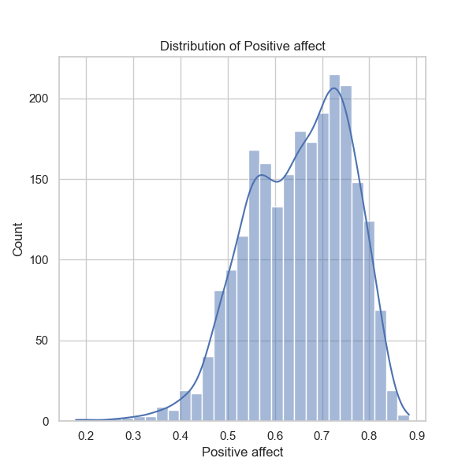
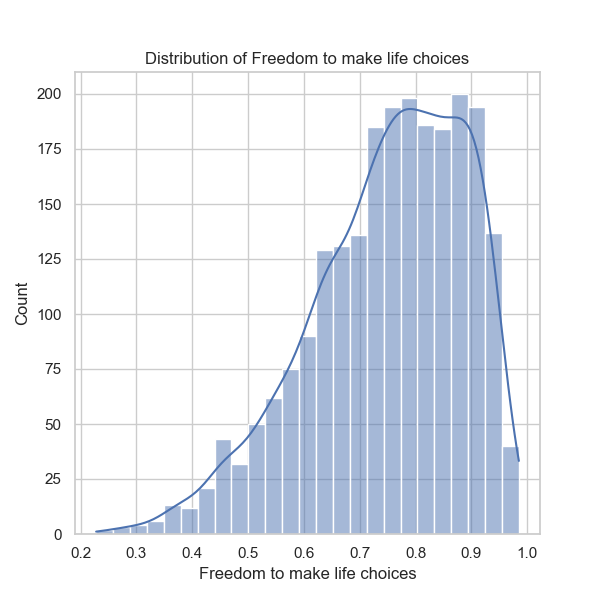
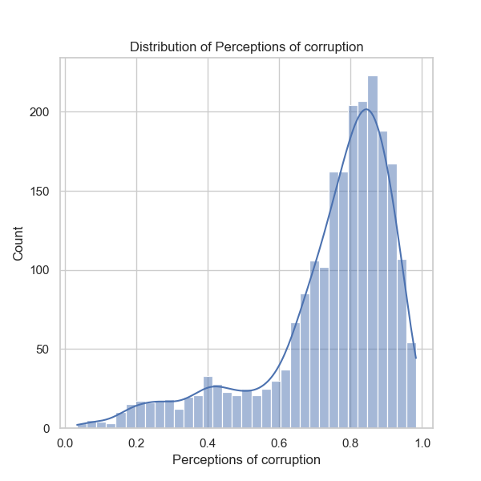
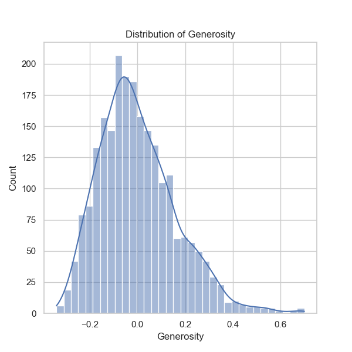
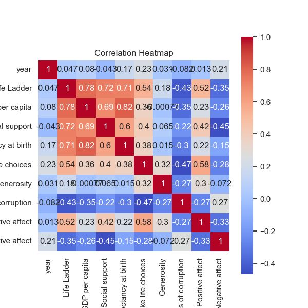
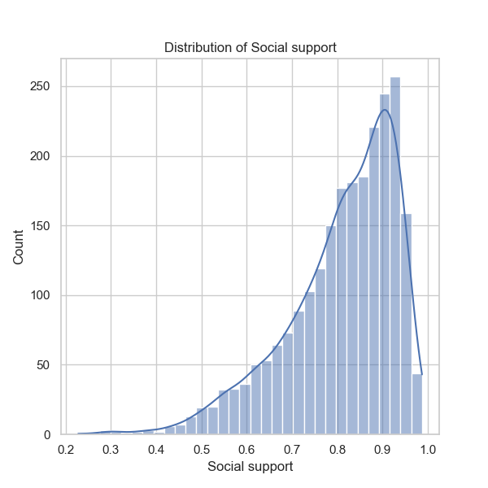
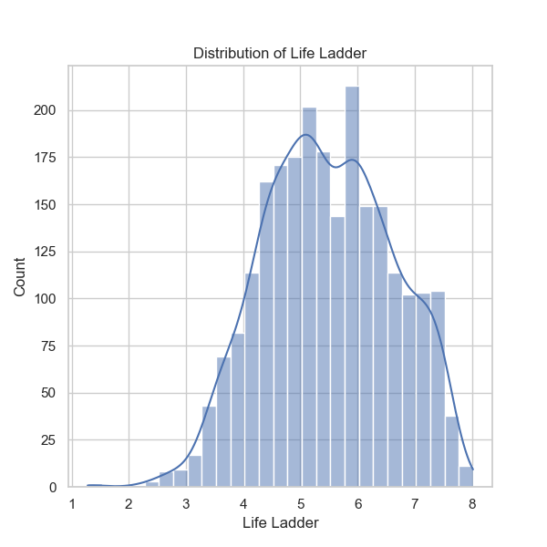
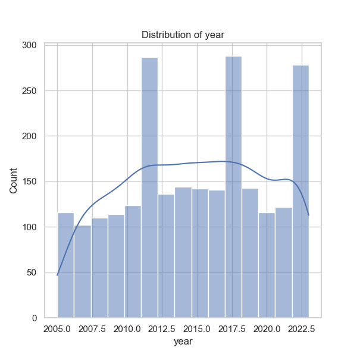
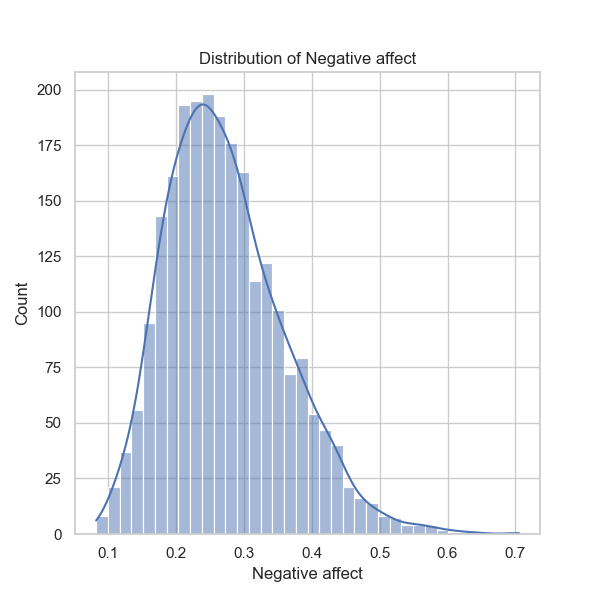
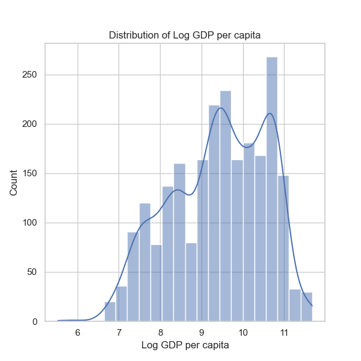
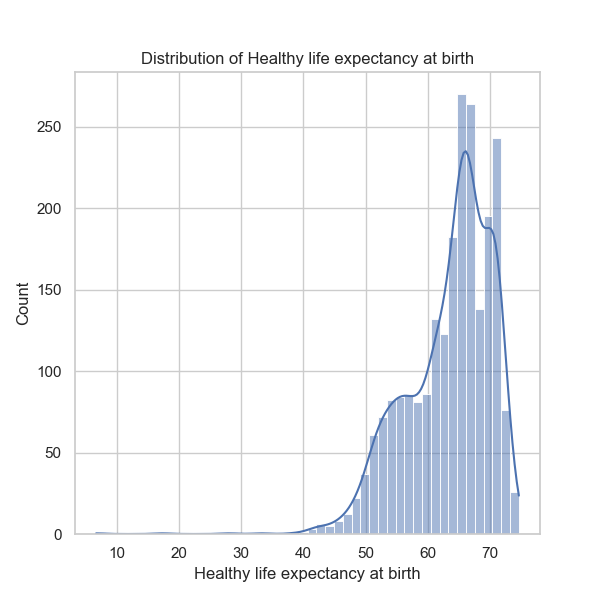