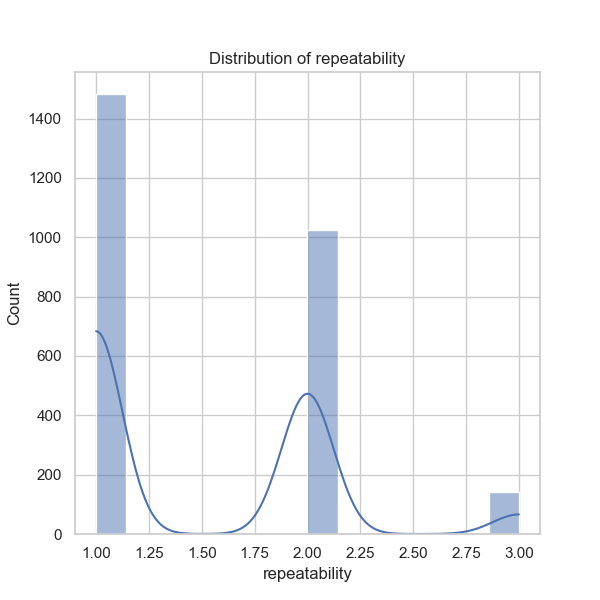
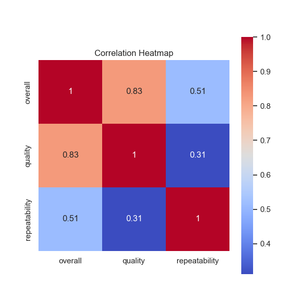
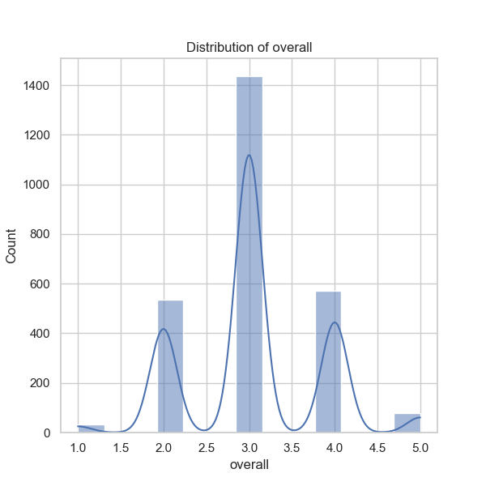
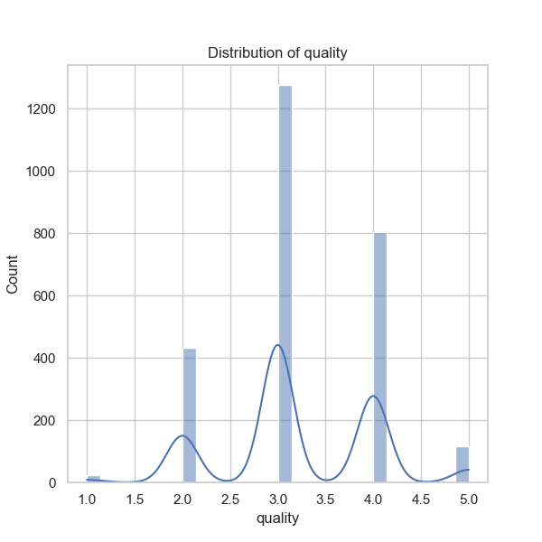

### Detailed Narrative Based on Data Analysis of 'media.csv'

#### Overview of the Dataset
The dataset 'media.csv' comprises 2,652 records detailing various media entries, with columns including date, language, type, title, author (by), overall rating, quality rating, and repeatability score. This dataset provides a snapshot of media items, predominantly movies, which can help in understanding consumer preferences and content quality.

### Key Findings

#### 1. **Temporal Distribution of Entries**
- The 'date' column shows that there are 2,553 entries but with 99 missing values. This indicates that certain media entries do not have an associated date, which can obscure time-based trends.
- The most frequent date is '21-May-06', with eight occurrences, suggesting that this date could be either a significant release date or a placeholder in the dataset. Given that actual release dates could impact media consumption and ratings, examining patterns across varied temporal segments (monthly, yearly) could yield interesting trends.

#### 2. **Language Distribution**
- The dataset includes 11 unique languages, with 'English' being the most predominant (1,306 entries). This reflects a strong focus on English-language media, which can skew insights into global media consumption.
- Further analysis could involve examining the ratings and qualities across different languages to assess performance and preferences. High-level comparisons may reveal biases towards certain languages.

#### 3. **Type of Media**
- The majority of entries (2,211) pertain to the media type 'movie'. As movies represent a significant portion of the dataset, additional insights could be garnered by segmenting ratings based on media type (movies, series, documentaries, etc.) to uncover preferences tied to formats.

#### 4. **Title and Author Popularity**
- The title 'Kanda Naal Mudhal' is noted as the most frequent at nine occurrences. While this could point to a popular film, the repetition might also indicate multiple submissions or reviews of the same title.
- The author 'Kiefer Sutherland' holds the highest frequency (48 entries), suggesting that his works contribute notably to this dataset. Exploring whether there's a correlation between the author's popularity and the overall ratings could yield interesting insights.

#### 5. **Rating Distributions**
- **Overall Ratings (mean = 3.05, std = 0.76)**: The average overall score hovers around the middle of the rating scale (1 - 5). Given the tight standard deviation, many ratings congregate around this mean, indicating a diversity of opinions.
- **Quality Ratings (mean = 3.21, std = 0.80)**: This metric is higher than the overall score, implying that while media often receives decent ratings, quality perceptions might vary significantly.
- **Repeatability Ratings (mean = 1.49, std = 0.60)**: Low repeatability scores suggest that media may not be frequently revisited, which could be indicative of either content quality or audience engagement levels.

#### 6. **Correlations**
- There is a strong positive correlation between overall ratings and quality ratings (0.83), highlighting that those who appreciate the media overall are likely to rate its quality favorably as well.
- The correlation between overall ratings and repeatability (0.51) indicates a moderate relationship, suggesting that a better overall experience might lead to higher repeat viewings.
- Quality and repeatability show a weaker correlation (0.31), indicating that perceived quality does not heavily influence a viewer's inclination to re-watch content.

### Recommendations for Further Analysis

1. **Time-Series Analysis**: 
   - A thorough examination of trends over time could reveal shifts in consumer preferences, media releases, and how ratings evolve. This could provide insights into the best release strategies or the impact of external factors (e.g., cultural shifts).

2. **Cluster Analysis**: 
   - Grouping similar entries based on ratings and type can uncover hidden patterns and consumer segments, thereby enabling targeted marketing strategies for different types of media.

3. **Anomaly Detection**: 
   - Identifying outliers in ratings (both high and low) can provide valuable insights. For example, a title that is rated significantly higher or lower than its peers could indicate an emerging trend or a failing element that warrants investigation.

4. **Sentiment Analysis**: 
   - If comments or descriptions are available for each media entry, performing sentiment analysis could enhance the understanding of consumer sentiments beyond numerical ratings.

5. **Comparative Analysis**: 
   - Assess the ratings and repeats across different media types or languages over the same temporal periods to identify which categories are performing better or worse in varying demographics.

### Conclusion
This dataset reveals a rich tapestry of media preferences, highlighting key trends in movie consumption, author popularity, and perceived quality versus repeatability metrics. By employing further analyses like clustering and time-series investigations, stakeholders can derive deeper insights that can significantly enhance engagement strategies in the media landscape.

